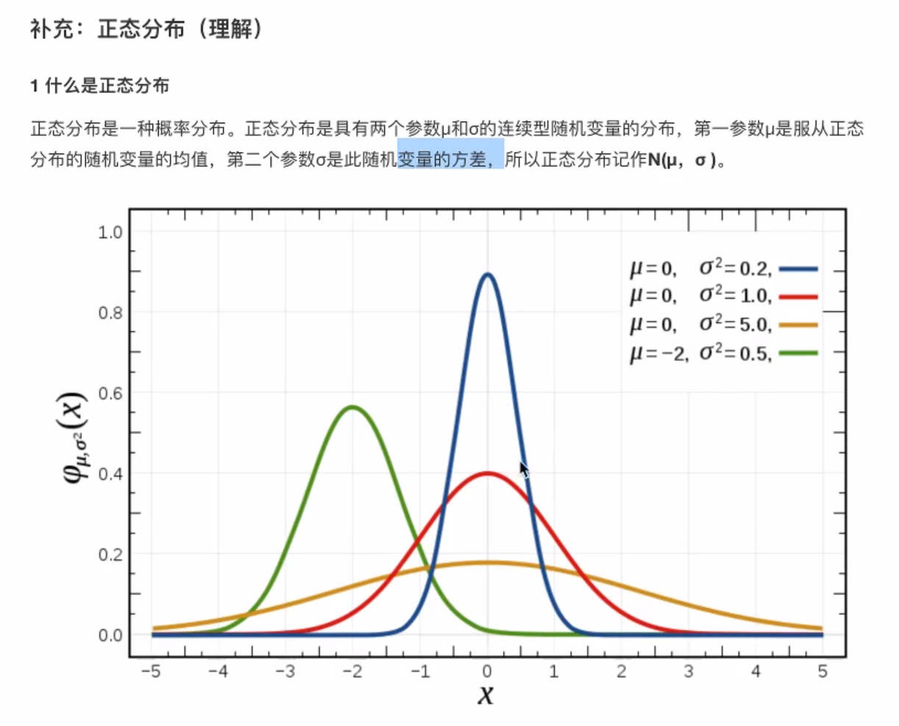

Numpy 高效的运算工具
Numpy的优势
ndarray属性
基本操作
    ndarray.方法()
    numpy.函数名()
ndarray运算
    逻辑运算
    统计运算
    数组间运算
合并、分割、IO操作、数据处理

3.1 Numpy优势
    3.1.1 Numpy介绍 - 数值计算库
        num - numerical 数值化的
        py - python
        ndarray
            n - 任意个
            d - dimension 维度
            array - 数组
    3.1.2 ndarray介绍
    3.1.3 ndarray与Python原生list运算效率对比
    3.1.4 ndarray的优势

​        1）存储风格
​            ndarray - 相同类型 - 通用性不强
​            list - 不同类型 - 通用性很强
​        2）并行化运算
​            ndarray支持向量化运算
​        3）底层语言
​            C语言，解除了GIL
3.2 认识N维数组-ndarray属性
​    3.2.1 ndarray的属性
​        shape
​            ndim
​            size
​        dtype
​            itemsize
​        在创建ndarray的时候，如果没有指定类型
​        默认
​            整数 int64
​            浮点数 float64
​    3.2.2 ndarray的形状
​    [1, 2, 3, 4]

    [[1, 2, 3, 4],
    [1, 2, 3, 4],
    [1, 2, 3, 4]]
    
    [[[1, 2, 3, 4],
      [1, 2, 3, 4],
      [1, 2, 3, 4]],
    
      [[1, 2, 3, 4],
      [1, 2, 3, 4],
      [1, 2, 3, 4]],
    [[1, 2, 3, 4],
    [1, 2, 3, 4],
    [1, 2, 3, 4]]]
    3.2.3 ndarray的类型

3.3 基本操作
    adarray.方法()
    np.函数名()
        np.array()
    3.3.1 生成数组的方法
        1）生成0和1
            np.zeros(shape)
            np.ones(shape)
        2）从现有数组中生成
            np.array() np.copy() 深拷贝
            np.asarray() 浅拷贝
        3）生成固定范围的数组
            np.linspace(0, 10, 100)
                [0, 10] 等距离

​      np.arange(a, b, c)
​            range(a, b, c)
​                [a, b) c是步长

​    4）生成随机数组
​       分布状况 - 直方图
​        1）均匀分布(uniform distribution)，均匀表示可能性相等的含义，均匀分布在自然情况下极为罕见，而人工栽培的有一定柱行距的植物群落即是均匀分布。
​            每组的可能性相等

​        2）正态分布
​            σ 幅度、波动程度、集中程度、稳定性、离散程度
3.3.2 数组的索引、切片
3.3.3 形状修改
​    ndarray.reshape(shape) 返回新的ndarray，原始数据没有改变
​    ndarray.resize(shape) 没有返回值，对原始的ndarray进行了修改
​    ndarray.T 转置 行变成列，列变成行
3.3.4 类型修改
​    ndarray.astype(type)
​    ndarray序列化到本地
​    ndarray.tostring()
3.3.5 数组的去重
​    set()

3.4 ndarray运算
    逻辑运算
        布尔索引
        通用判断函数
            np.all(布尔值)
                只要有一个False就返回False，只有全是True才返回True
            np.any()
                只要有一个True就返回True，只有全是False才返回False
        np.where（三元运算符）
            np.where(布尔值, True的位置的值, False的位置的值)
    统计运算
        统计指标函数
            min, max, mean, median, var, std
            np.函数名
            ndarray.方法名
        返回最大值、最小值所在位置
            np.argmax(temp, axis=)
            np.argmin(temp, axis=)
    数组间运算
        3.5.1 场景
        3.5.2 数组与数的运算
        3.5.3 数组与数组的运算
            3.5.4 广播机制
        3.5.5 矩阵运算
            1 什么是矩阵
                矩阵matrix 二维数组
                矩阵 & 二维数组
                两种方法存储矩阵
                    1）ndarray 二维数组
                        矩阵乘法：
                            np.matmul
                            np.dot
                    2）matrix数据结构
            2 矩阵乘法运算
                形状
                    (m, n) * (n, l) = (m, l)
                运算规则
                    A (2, 3) B(3, 2)
                    A * B = (2, 2)
3.6 合并、分割
3.7 IO操作与数据处理
    3.7.1 Numpy读取
    3.7.2 如何处理缺失值
        两种思路：
            直接删除含有缺失值的样本
            替换/插补
                按列求平均，用平均值进行填补